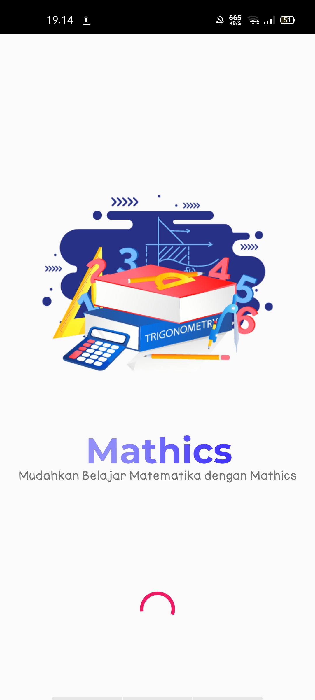
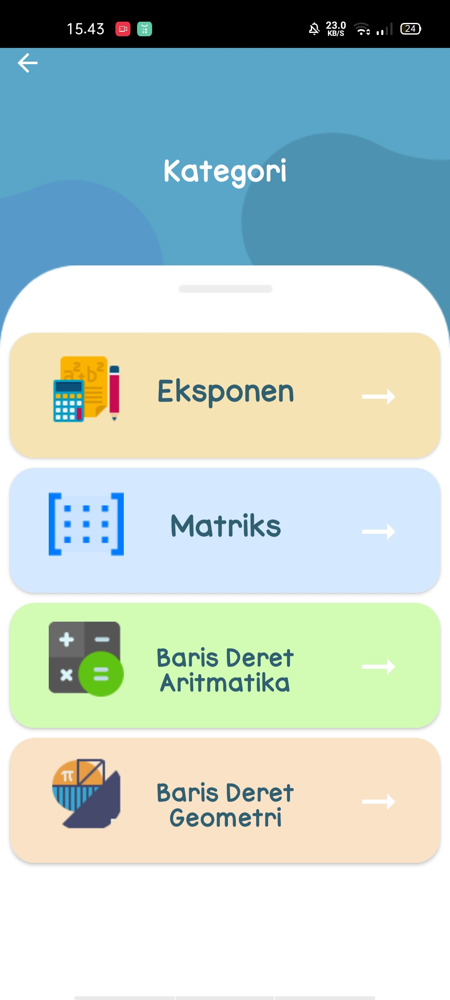
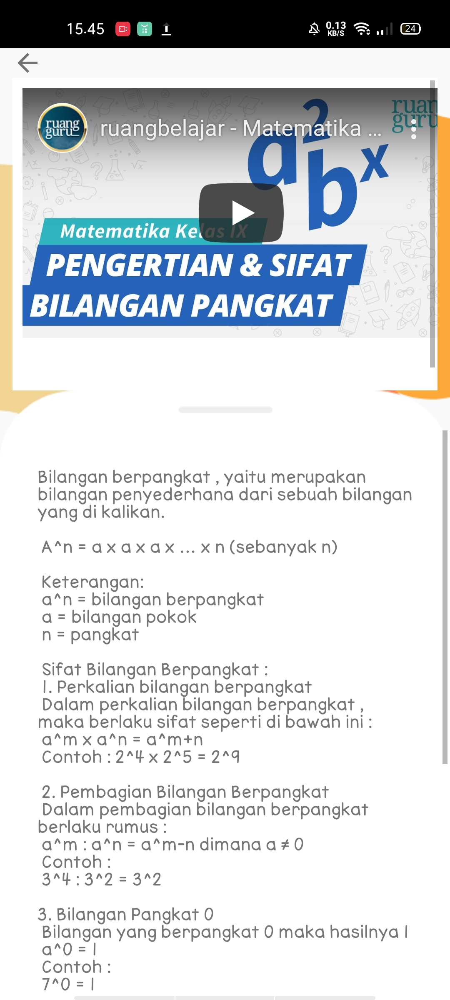

# Mathics

## What is Mathics
> Mathics merupakan sebuah aplikasi pembelajaran matematika berbasis Android. Aplikasi Mathics akan membantu user untuk mempelajari materi matematika dengan beberapa fitur utama yaitu menonton video dan rangkuman materi. 

## How does it work?
- [x] Install Mathics
- [x] Pilih materi sesuai keinginan dan pastikan sudah terhubung dengan internet untuk dapat menonton video

## Built with
- [x] Android studio 
> ### dengan menggunakan:
> - [x] Card View
>>> [Selengkapnya](https://developer.android.com/guide/topics/ui/layout/cardview?hl=id)
> - [x] Web View 
>>> Untuk menampilkan video dari Youtube dengan cara menggunakan internet
        
## Cara Kerja Aplikasi Mathics :

# Loading Aplikasi

# Tampilan menu

# About Us

# Category Materi

# Category sub materi

# Sub materi

# Thank You
- Alfian Nur D / 04

- Rensi Meila Y / 34

- Salsabilla Maurettasya A / 39
